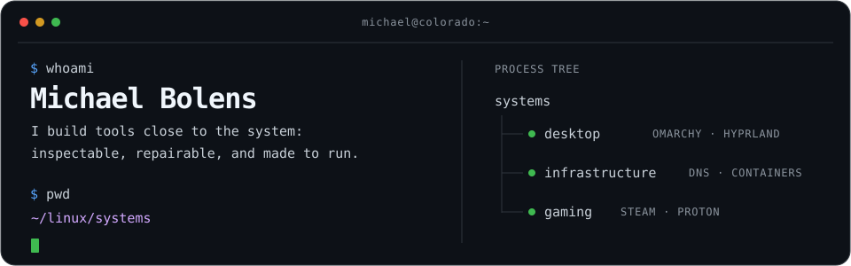

I build practical tools close to the system, from dynamic DNS and desktop 
automation to game-launch pipelines and incident-response utilities.

<a href="#current-focus">Current</a> · <a href="#featured-projects">Projects</a> · <a href="#toolbox">Toolbox</a> · <a href="#more-from-my-work">More</a>

Lakewood, Colorado · formerly Milwaukee, Wisconsin

## Current focus

- **Secure infrastructure:** [uDDNS](https://github.com/bolens/uddns),
  [aur-response-toolkit](https://github.com/bolens/aur-response-toolkit), and a
  Docker Compose homelab
- **Desktop control:** Omarchy Shell and Quickshell extensions for privacy
  controls and peer-to-peer service management
- **Linux gaming:** tools for Steam, Gamescope, Proton, Millennium, KDE Plasma,
  and Hyprland

## Featured projects

### Systems and utilities

| Project | Job | Stack |
| :--- | :--- | :--- |
| **[launch-layer](https://github.com/bolens/launch-layer)** · [guide](https://bolens.github.io/launch-layer/) | Build repeatable Steam launch chains from layered configuration | `Shell` `TypeScript` `Python` |
| **[uDDNS](https://github.com/bolens/uddns)** · [guide](https://bolens.github.io/uddns/) | Update DNS records across multiple providers when a public IP changes | `TypeScript` |
| **[aur-response-toolkit](https://github.com/bolens/aur-response-toolkit)** · [guide](https://bolens.github.io/aur-response-toolkit/) | Detect, triage, and recover from known AUR supply-chain incidents | `Rust` |
| **[millennium-helpers](https://github.com/bolens/millennium-helpers)** · [guide](https://bolens.github.io/millennium-helpers/) | Install, repair, update, and diagnose Millennium on Linux and Windows | `Go` `Shell` `PowerShell` |

### Omarchy desktop suite

| Project | Job | Stack |
| :--- | :--- | :--- |
| **[App Drawer](https://github.com/bolens/omarchy-app-drawer)** · [guide](https://bolens.github.io/omarchy-app-drawer/) | Reveal, collapse, and pin stock-bar widgets per monitor | `QML` |
| **[Multi-Monitor Workspaces](https://github.com/bolens/omarchy-multi-monitor-workspaces)** · [guide](https://bolens.github.io/omarchy-multi-monitor-workspaces/) | Assign deterministic workspace banks across any number of monitors | `QML` |
| **[Privacy Devices](https://github.com/bolens/omarchy-privacy-devices)** · [guide](https://bolens.github.io/omarchy-privacy-devices/) | Monitor and control microphones, cameras, location, and screen sharing | `QML` `Python` |
| **[P2P Services](https://github.com/bolens/omarchy-p2p-services)** · [guide](https://bolens.github.io/omarchy-p2p-services/) | Discover and control local peer-to-peer and overlay-network services | `QML` `Python` |

## Toolbox

| Systems | Languages | Operations |
| :--- | :--- | :--- |
| Linux · Arch Linux · CachyOS | TypeScript · Rust · Go · QML | Docker Compose · Caddy · MCP |
| KDE Plasma · Hyprland · Omarchy | PowerShell · Bash · Fish | GitHub Actions · systemd |

## More from my work

[PowerShell profile](https://github.com/bolens/ps-profile) ·
[Fish configuration](https://github.com/bolens/fish-config) ·
[Waybar setup](https://github.com/bolens/waybar-config) ·
[desktop icon tooling](https://github.com/bolens/appicon) ·
[workstation configuration](https://github.com/bolens/arch-config) ·
[homelab configuration](https://github.com/bolens/homelab)

Open to conversations about practical Linux, self-hosting, gaming, and desktop
tooling here on [GitHub](https://github.com/bolens).

When I'm away from a keyboard, you'll usually find me camping, hiking, cycling,
playing disc golf, or exploring Colorado's craft beer scene.

### Git hooks

Run `bash scripts/install-git-hooks` once per clone. The pre-commit hook runs fast staged checks; pre-push runs the broader local CI gate.
